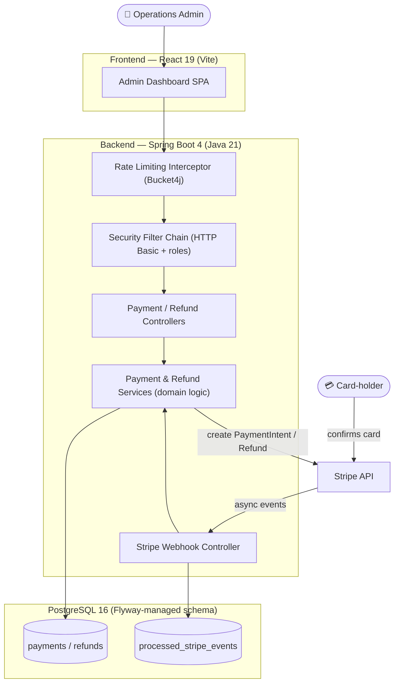
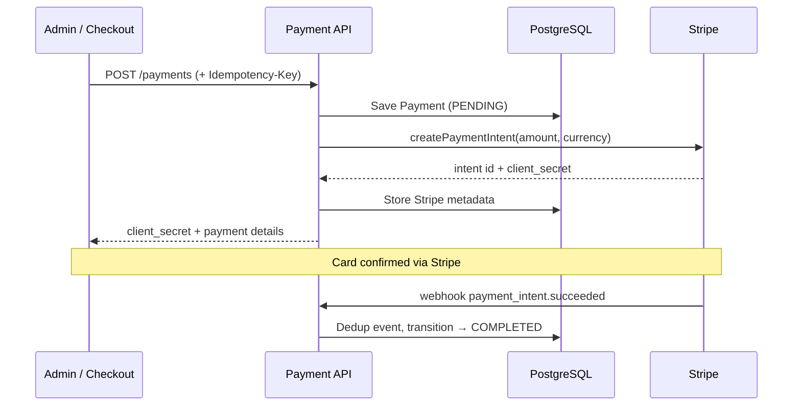

# Payment Service — Capabilities & Technical Overview

*Status as of June 2026 · Audience: technical and non-technical stakeholders*

This document explains **what the Payment Service does today**. It is written in two layers:
a plain-language section for business and product stakeholders, and a technical section for
engineers and architects. Everything described here is **built and working in the current
codebase** — the planned/future work is clearly separated at the end.

---

## 1. One-paragraph summary

The Payment Service is the software behind a merchant's "Pay Now" button. It creates and
tracks payments, charges real cards through **Stripe**, processes full and partial refunds,
and keeps a permanent, auditable record of every transaction. It ships with a **web-based
admin dashboard** for operations staff and is built with production-grade safeguards:
duplicate-charge prevention, concurrency protection, rate limiting, request tracing, and
health metrics.

---

## 2. For business & non-technical stakeholders

### What it does, by analogy

Think of a shop with a till and a back office:

| Part of the system | Real-world equivalent | What it does |
|---|---|---|
| The **API** (backend) | The cash register | Records each sale, talks to the card network, never charges twice |
| The **Admin Dashboard** (frontend) | The back-office screen | Staff view, search, and refund payments |
| The **Database** | The ledger book | A permanent, tamper-evident record of every transaction |
| **Stripe** | The card network / bank terminal | Actually moves the money |

### Capabilities available today

1. **Take a payment** — Records the amount, currency, and method, and creates a real Stripe
   charge intent so an actual card can be processed.
2. **Never double-charge** — If the same request arrives twice (a double-click, a network
   retry), the system recognises it and returns the original payment instead of charging
   again. *(Industry term: idempotency.)*
3. **Track payment status automatically** — Stripe notifies the system as a payment moves
   through *Pending → Processing → Completed* (or *Failed*). No manual updating required.
4. **Issue refunds** — Full or partial refunds (e.g. return $20 of a $50 charge), processed
   through Stripe and reflected in the records.
5. **Search & filter** — Admins can list and filter payments by status, currency, or payment
   method, with pagination for large volumes.
6. **Stay up under load** — If requests arrive too fast, the system politely asks the caller
   to slow down rather than crashing.
7. **Be traceable & auditable** — Every request carries a unique tracking ID that threads
   through all logs, so any issue can be investigated quickly.
8. **Report its own health** — Continuously publishes performance and error metrics for
   monitoring tools.

### Who can do what

Access is role-based. Regular users can create and view payments and refunds; administrators
additionally get full listing/filtering and the ability to manually change a payment's status.

> **Note:** Login today uses simple built-in developer accounts. Enterprise login (OAuth2 /
> Amazon Cognito) is on the roadmap, not yet implemented.

---

## 3. For technical stakeholders

### 3.1 Architecture at a glance

A decoupled full-stack application: a Spring Boot REST API backed by PostgreSQL, with a React
single-page admin app. Stripe is integrated synchronously (charge creation) and
asynchronously (status updates via webhooks).



### 3.2 Technology stack

| Layer | Technology |
|---|---|
| Language / runtime | Java 21 |
| Framework | Spring Boot 4.0.6 — Web MVC, Data JPA, Security, Validation, Actuator |
| Payments | Stripe Java SDK |
| Database | PostgreSQL 16, schema versioned with **Flyway** (Hibernate is `validate`-only) |
| Resilience | Bucket4j (rate limiting), JPA optimistic locking |
| Observability | Micrometer + Actuator (Prometheus endpoint), Logback (JSON in prod, readable locally), MDC correlation IDs |
| API docs | springdoc OpenAPI 3 (Swagger UI) |
| Frontend | React 19, React Router 7, Vite 5, Axios, react-toastify |
| Build / test | Maven wrapper, JUnit 5, Testcontainers |
| Local infra | Docker Compose (PostgreSQL) |

### 3.3 API surface

Base path `/api/v1/payments`:

| Method & path | Purpose | Roles |
|---|---|---|
| `POST /payments` | Create payment (optional `Idempotency-Key` header) | USER, ADMIN |
| `GET /payments` | List/filter by `status`, `currency`, `paymentMethod` (paged) | ADMIN |
| `GET /payments/{id}` | Get one payment | USER, ADMIN |
| `PATCH /payments/{id}/status` | Manually update status | ADMIN |
| `POST /payments/{id}/refunds` | Create a refund | USER, ADMIN |
| `GET /payments/{id}/refunds` | List refunds for a payment | USER, ADMIN |
| `POST /api/v1/webhooks/stripe` | Receive Stripe events (signature-verified) | Stripe (public, verified) |

Supporting endpoints: `GET /swagger-ui.html`, `GET /v3/api-docs`, and Actuator
(`/actuator/health,info,metrics,prometheus`).

### 3.4 Payment lifecycle & state machine

Statuses: **PENDING, PROCESSING, COMPLETED, FAILED, REFUNDED**.

Transitions are enforced server-side (invalid transitions are rejected):

```
PENDING    → PROCESSING | COMPLETED | FAILED
PROCESSING → COMPLETED | FAILED
COMPLETED  → REFUNDED
```



### 3.5 Reliability & correctness mechanisms

- **Idempotent payment creation** — Dedupes on the `Idempotency-Key` header, backed by a
  unique DB constraint. A race that slips past the lookup is caught as a constraint violation,
  the existing record is validated against the new request, and returned — no second Stripe
  call. Reusing a key with *different* details returns a conflict error.
- **Webhook deduplication** — Every Stripe event ID is recorded in `processed_stripe_events`
  before processing (idempotent-consumer pattern), so retried/duplicate webhooks are no-ops.
- **Webhook signature verification** — Inbound payloads are cryptographically verified against
  the Stripe signing secret; unverified payloads are rejected with `400`.
- **Optimistic locking** — `Payment` and `Refund` carry a JPA `@Version`; concurrent edits
  surface as `409 Conflict` rather than silent data loss.
- **Rate limiting** — POST creates are throttled to 20/min per caller (Bucket4j) → `429`.
- **Zero-decimal currency handling** — Stripe amounts are computed in the smallest unit, with
  correct handling for zero-decimal currencies (JPY, KRW, CLP).
- **Centralised error handling** — A `GlobalExceptionHandler` maps domain exceptions to a
  consistent `ErrorResponse` (including the correlation ID).

### 3.6 Observability & operations

- **Correlation IDs** — Each request gets an `X-Correlation-Id` (honoured if inbound, else
  generated), placed in the MDC, returned in responses and error bodies, and stamped on logs.
- **Structured logging** — Readable locally, JSON in production-like profiles for log
  aggregation.
- **Metrics** — Actuator + Micrometer expose `/actuator/prometheus` for scraping.

### 3.7 Data & schema governance

The schema is **owned by Flyway**, not Hibernate (`ddl-auto=validate`). Migrations to date:

- `V1` — initial payments/refunds schema
- `V2` — optimistic-locking version columns
- `V3` — Stripe fields (`stripe_payment_intent_id`, `stripe_client_secret`) + the
  `processed_stripe_events` dedup table

### 3.8 Security posture (current)

HTTP Basic auth with in-memory users (`user`/USER, `admin`/ADMIN), role-based authorization,
CSRF disabled, CORS allow-listed to the local frontend origins. **This is dev-only** and is
explicitly slated for replacement before any real deployment.

---

## 4. What is built vs. planned

| Capability | Status |
|---|---|
| Payment CRUD + filtering, refunds (full/partial) | ✅ Built |
| Stripe charge + refund integration | ✅ Built |
| Webhook-driven status updates + dedup + signature verification | ✅ Built |
| Idempotency, optimistic locking, rate limiting | ✅ Built |
| Correlation IDs, structured logs, Prometheus metrics, OpenAPI docs | ✅ Built |
| React admin dashboard | ✅ Built |
| Enterprise auth (OAuth2 / Amazon Cognito) | ⬜ Planned |
| Async refund queue (SQS + DLQ) | ⬜ Planned |
| Email/SNS notifications, PDF receipts to S3 | ⬜ Planned |
| AWS deployment (ECS Fargate, RDS), CI/CD, Terraform | ⬜ Planned |

The full cloud blueprint is in [aws-architecture.md](aws-architecture.md); roadmap detail in
[ROADMAP.md](ROADMAP.md) and progress in [PROGRESS.md](PROGRESS.md).

---

## 5. How to run it (engineers)

1. `docker compose up -d` — start PostgreSQL
2. `./mvnw spring-boot:run` — backend on `:8080`
3. `cd frontend && npm install && npm run dev` — dashboard on `:5173`

Build: `./mvnw clean package` · Tests: `./mvnw test` (Testcontainers; Docker required).
