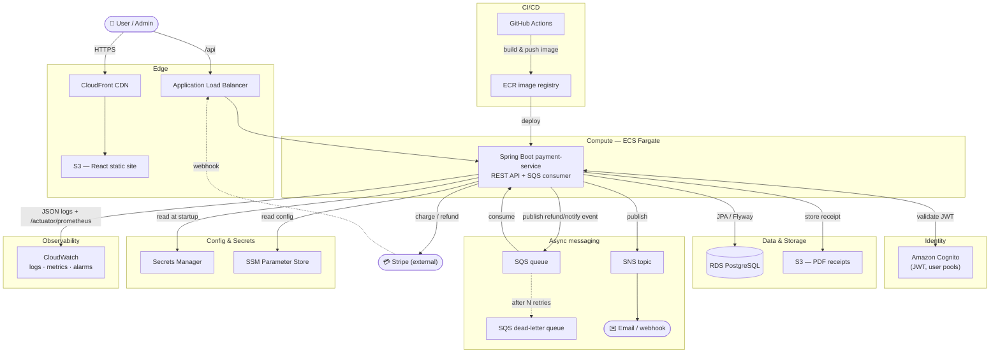
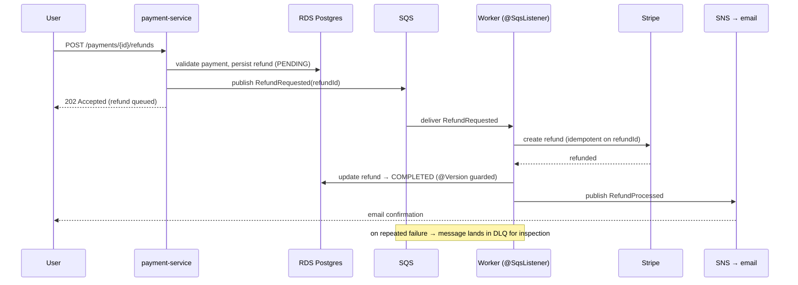

# Payment Service — Action Plan & Architecture

This is the master plan for taking the Payment Service from a clean full-stack CRUD app to a
production-shaped, cloud-deployed system suitable for a senior-level resume project.

- **Progress tracker** (what's done / in flight): [PROGRESS.md](PROGRESS.md)
- **AWS service mapping** (detail): [aws-architecture.md](aws-architecture.md)
- **Plain-English overview**: [PROJECT_OVERVIEW.md](PROJECT_OVERVIEW.md)
- **Editable diagram**: [architecture.drawio](architecture.drawio) (open in [draw.io](https://app.diagrams.net) or the VS Code "Draw.io Integration" extension)

---

## 1. The four tracks

| Track | Theme | AWS? | Status |
|---|---|---|---|
| **1. API maturity** | Make the API observable, documented, safe under load | No | ✅ Done |
| **2. Real payment flow** | Stripe test-mode + webhooks → real async status changes | No | ⬜ Planned |
| **3. Cloud integration** | SQS/SNS/S3/Cognito/Secrets/RDS (LocalStack first) | Yes | ⬜ Planned |
| **4. DevOps / CI-CD** | Dockerfile, GitHub Actions, Terraform IaC, ECS deploy | Yes | ⬜ Planned |

Each track is independently demoable and interview-talkable. Build order is 1 → 2 → 3 → 4,
but 2 and 3 can swap depending on what you want to show first.

---

## 2. Target architecture (high level)

> Auth to AWS is via an **ECS task role** — there are no static AWS keys in the app or image.
> Locally, the same code runs against **LocalStack** by overriding service endpoints.

---

## 3. Request lifecycle (a refund, end to end)

---

## 4. Track detail

### Track 1 — API maturity ✅ (done)
- Correlation IDs (MDC → logs → response header → error body)
- Structured JSON logging (readable locally, JSON in prod)
- Optimistic locking (`@Version`, 409 on concurrent edits)
- Rate limiting (Bucket4j, 20 writes/min/caller, 429)
- OpenAPI 3 / Swagger UI (springdoc)
- Prometheus metrics (`/actuator/prometheus`)

### Track 2 — Real payment flow (Stripe) ⬜
1. Add Stripe Java SDK; keys via Secrets Manager / env.
2. On payment create → create Stripe PaymentIntent; store the intent id.
3. Expose `POST /webhooks/stripe` (signature-verified, CSRF-exempt, permitAll).
4. Webhook events drive status transitions instead of the manual PATCH.
5. Idempotent webhook handling (dedupe on Stripe event id).
6. Tests with Stripe's test cards + the Stripe CLI for local webhook forwarding.

### Track 3 — Cloud integration ⬜
1. **SQS + SNS** — async refund + notification pipeline (`@SqsListener`, DLQ, idempotent consumer).
2. **S3** — generate PDF receipt on completion (repo `pdf` skill), store, return pre-signed URL.
3. **Cognito** — replace in-memory Basic auth with JWT resource server; map groups → roles. Keep Basic auth under the `local` profile only.
4. **Secrets Manager / SSM** — externalize DB creds, Stripe keys, queue/topic ARNs.
5. **RDS** — point `prod` profile at managed Postgres (no code change beyond config).
- All of the above run against **LocalStack** first (`docker-compose.yml` has the stub), then flip to real AWS by changing endpoints only.

### Track 4 — DevOps / CI-CD ⬜
1. Multi-stage **Dockerfile** (build with Maven, run on a slim JRE; layer the boot jar).
2. **GitHub Actions**: build → test (Testcontainers) → push image to **ECR** → deploy to **ECS**.
3. **Terraform** for all infra (VPC, RDS, ECS, ALB, SQS, SNS, S3, Cognito, IAM roles) — the biggest IaC signal.
4. **CloudWatch** dashboards + alarms (5xx rate, p99 latency, queue depth, DLQ > 0).
5. Health-check based rolling deploys via the actuator probes.

---

## 5. What each track proves on a resume

| Track | Skills demonstrated |
|---|---|
| 1 | Observability, API design, concurrency safety, operational hardening |
| 2 | Third-party integration, webhooks, event-driven status, idempotency |
| 3 | Cloud-native architecture, async messaging, managed services, secrets hygiene |
| 4 | CI/CD, containerization, Infrastructure as Code, deployment & monitoring |
