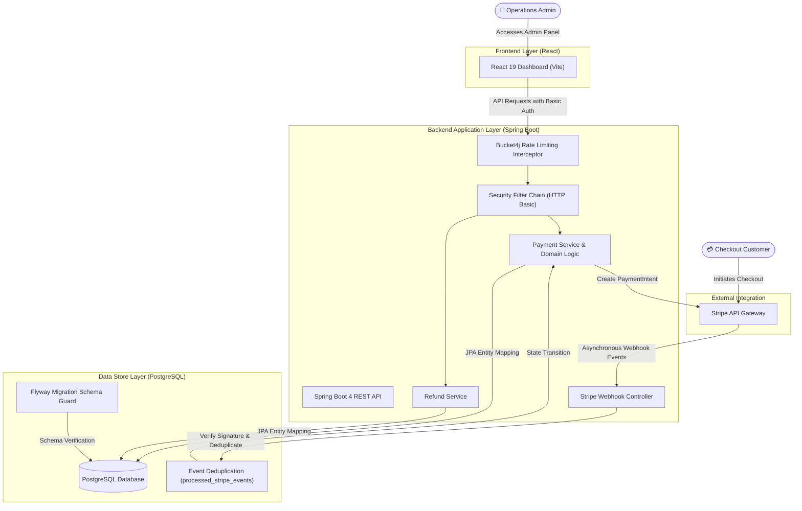
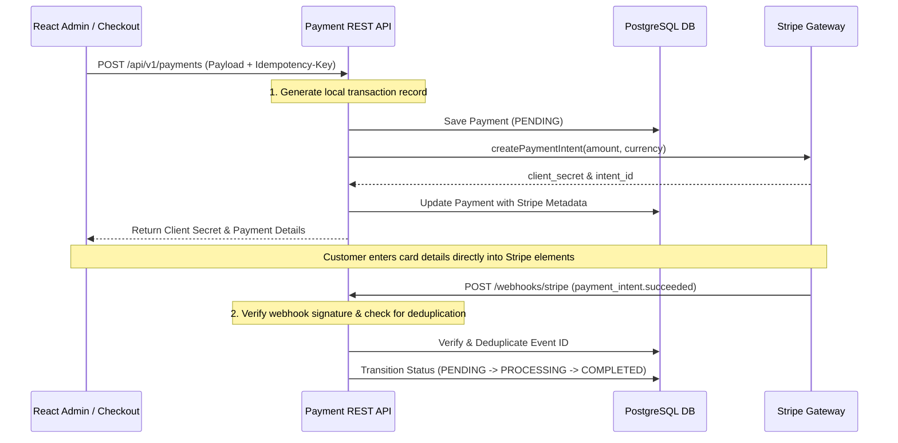
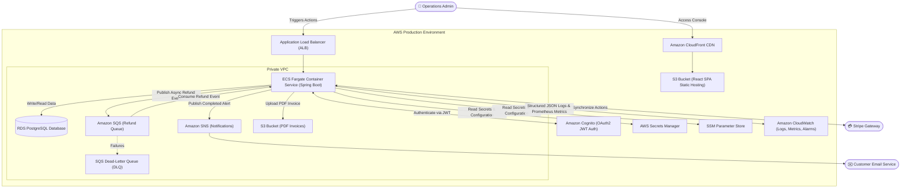

# Payment Service: Executive & Technical Overview

This document provides a comprehensive overview of the **Payment Service** project. It is structured to serve both **non-technical stakeholders** (who need to understand the business value, features, and roadmap) and **technical stakeholders** (who require deep insights into the architecture, technology stack, and security mechanisms).

---

## Table of Contents
1. [Executive Summary (For All Stakeholders)](#1-executive-summary-for-all-stakeholders)
2. [Business & Functional Overview (For Non-Technical Stakeholders)](#2-business--functional-overview-for-non-technical-stakeholders)
3. [Technical Architecture & Deep Dive (For Technical Stakeholders)](#3-technical-architecture--deep-dive-for-technical-stakeholders)
4. [Current Implementation Status](#4-current-implementation-status)
5. [Future Roadmap (AWS Cloud & DevOps Migration)](#5-future-roadmap-aws-cloud--devops-migration)

---

## 1. Executive Summary (For All Stakeholders)

The **Payment Service** is a secure, reliable, and high-performance financial transaction system. At its core, the project acts as the brain behind a merchant's "Pay Now" checkout button, handling the processing, tracking, and refunding of transactions.

### Key Value Propositions
* **Revenue Protection (Idempotency):** Prevents customers from being double-charged due to double-clicks or unstable internet connections.
* **Real-time Stripe Integration:** Leverages Stripe's payment gateway to process actual customer cards securely.
* **Unified Admin Control Panel:** A clean web-based dashboard allowing operations staff to monitor, search, and refund transactions instantly.
* **Enterprise-Ready Infrastructure Blueprint:** Designed to easily scale into Amazon Web Services (AWS) using industry-standard cloud patterns.

---

## 2. Business & Functional Overview (For Non-Technical Stakeholders)

### A Real-World Analogy
To understand this system, think of a physical retail store:
1. **The Cash Register (The API):** Where customers bring their items to pay. The register scans items, accepts cards, and outputs a receipt.
2. **The Back Office Screen (The React Frontend):** Where the shop manager logs in to view the day's sales, search for a specific customer, or click "Refund" to hand cash back.
3. **The Secure Safe & Ledger Book (The Database):** A permanent, tamper-resistant record of every penny that entered or left the store.

### Current Features & Capabilities
* **Process Payments Securely:** Records transactional details (amount, currency, method) and coordinates with Stripe to process transactions.
* **Flexible Refunds:** Supports both full refunds and partial refunds (e.g., returning $20 of a $50 transaction) directly from the admin panel.
* **Search & Filters:** Enables managers to locate transactions based on Status (*Pending, Processing, Completed, Failed, Refunded*), Currency (USD, EUR, etc.), or Payment Method.
* **System Safeguards:** Protects itself against spikes in usage by asking users to wait if requests come in too quickly, ensuring the system never crashes during peak checkout hours.

---

## 3. Technical Architecture & Deep Dive (For Technical Stakeholders)

### System Architecture
The payment application operates as a decoupled full-stack architecture, utilizing a RESTful Spring Boot backend and a React Single Page Application (SPA) admin dashboard.

### Technology Stack
* **Backend:** Java 21, Spring Boot 4.0.6 (Spring Web, Spring Data JPA, Spring Security, Validation, Actuator).
* **Frontend:** React 19, React Router 7, Vite 5, Axios, CSS Modules, Toast Notifications.
* **Database & Migrations:** PostgreSQL 16, Flyway Migrations (Schema version control managed outside Hibernate).
* **Build Tools & Emulation:** Maven Wrapper, Docker Compose (local dev DB setup).

---

### Technical Deep Dives

#### 1. Payment Lifecycle & Webhook State Machine
Rather than updating payment status synchronously (which blocks user execution and risks inconsistency), the application uses an **asynchronous webhook-driven state machine** powered by Stripe.

#### 2. Bulletproof Idempotency & Deduplication
To prevent duplicate charges (e.g., when a user double-clicks the purchase button), the API implements a strict idempotency layer:
* **API Ingestion:** Payment creation endpoints require an `Idempotency-Key` header.
* **Database Constraint:** A unique database constraint on `payments.idempotency_key` guarantees database-level safety. If a thread race condition occurs, the database throws a constraint violation, which is caught, matching parameters verified, and the original payment record safely returned without a second Stripe call.
* **Webhook Deduplication:** Webhook payloads from Stripe are recorded in a `processed_stripe_events` table before processing. If an event ID is already present, it is ignored (idempotent consumer pattern).

#### 3. Concurrency Protection (Optimistic Locking)
To safeguard transactions from concurrent edits (e.g., two administrators attempting to refund or alter the payment status at the exact same millisecond), database tables utilize JPA `@Version` optimistic locking. Any concurrent update collision throws an `OptimisticLockingFailureException`, which is translated to an HTTP `409 Conflict` response, preserving state integrity.

#### 4. Operational Telemetry & Observability
* **Correlation IDs:** Every API request receives a unique `X-Correlation-Id` header (honored if inbound, otherwise generated). This ID is stored in the Logging MDC (Mapped Diagnostic Context) so that all log statements emitted within a single transaction share the exact same tracking token. It is also returned in client error payloads to facilitate fast issue resolution.
* **Structured Logging:** Configured via `logback-spring.xml` to output human-readable logs locally and structured JSON logging in production-like profiles to feed directly into log aggregation systems (e.g., Elasticsearch, CloudWatch Logs).
* **Rate Limiting:** Protects resources by throttling payment-creation POST requests using a Bucket4j filter (`RateLimitingInterceptor`) configured to limit callers to a maximum of 20 writes per minute.
* **Metrics Scrapes:** Integrates Spring Boot Actuator and Micrometer to output standard metrics on the `/actuator/prometheus` endpoint, which is ready to be scraped by Prometheus or AWS Distro for OpenTelemetry (ADOT).

---

## 4. Current Implementation Status

### Track 1: API Maturity (Completed ✅)
* Centralized MDC-based correlation ID tracking.
* Dynamic structured JSON logs.
* Database-level concurrency safety using optimistic locking.
* Bucket4j write throttling.
* OpenAPI 3.0 (Swagger UI) API generation.
* Actuator Prometheus metrics telemetry hooks.

### Track 2: Payment Integrations (Completed ✅)
* Core integration of the Stripe Java SDK.
* Secure webhook listener endpoint (`POST /webhooks/stripe`) with cryptographic signature verification.
* Robust deduplication ledger for Stripe webhook events.
* Full support for partial and complete refunds.

---

## 5. Future Roadmap (AWS Cloud & DevOps Migration)

The next steps transition the system from local Docker/localhost environments into a highly available, cloud-native architecture.

### Planned Upgrade Tracks

#### Track 3: AWS Cloud Integration (Upcoming ⬜)
1. **Asynchronous Refund Queue (SQS + DLQ):** Moves refund operations out of HTTP request threads. Refunds are queued in SQS, processed asynchronously, and failing jobs move to a Dead Letter Queue (DLQ) for engineering inspection, ensuring zero lost operations.
2. **SNS Customer Notifications:** Publishes messages to SNS upon successful payment/refund events, fanning out to email providers or third-party webhooks.
3. **S3 Invoicing:** Generates PDF receipts on payment completion, uploads them to an S3 bucket, and secures access using AWS pre-signed URLs.
4. **OAuth2 Migration (Amazon Cognito):** Swaps basic developer logins for enterprise-grade JWT-based verification linked to Amazon Cognito.

#### Track 4: Cloud Infrastructure-as-Code & DevOps (Upcoming ⬜)
1. **Containerization:** Packages the application using multi-stage Dockerfiles optimized for tiny footprints and fast startup.
2. **Continuous Integration/Deployment (CI/CD):** Constructs GitHub Actions workflows to auto-run Testcontainers suites, build images, upload them to AWS Elastic Container Registry (ECR), and perform zero-downtime rolling upgrades on ECS Fargate.
3. **Terraform Infrastructure:** Authors Terraform templates to provision all resources (VPC, ECS, SQS, RDS, ALB, S3, Cognito) safely as code, eliminating manual console configuration.
